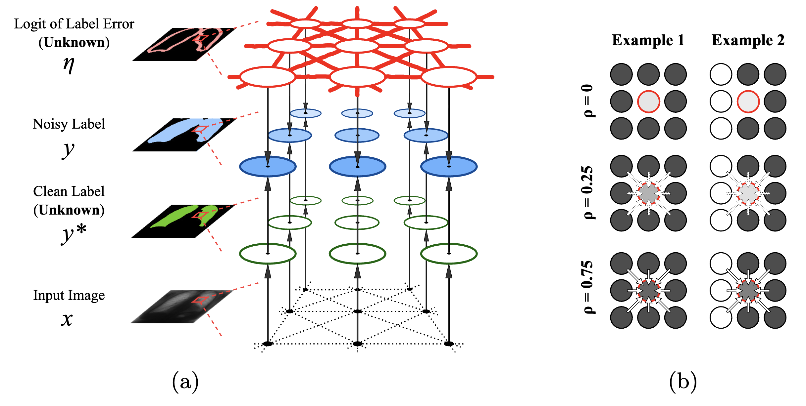

# A Bayesian Approach to Segmentation with Noisy Labels via Spatially Correlated Distributions

This repository contains the public implementation of our method described in the paper:

**A Bayesian Approach to Segmentation with Noisy Labels via Spatially Correlated Distributions**  
Ryu Tadokoro, Tsukasa Takagi, Shin-ichi Maeda  
https://arxiv.org/abs/2504.14795



Our approach models label noise in semantic segmentation with a probabilistic framework that incorporates spatial correlations. By introducing a continuous latent variable to represent the logit of the label error probability and structuring its covariance via a Kac-Murdock-Szegö (KMS) matrix, the method efficiently computes an Evidence Lower Bound (ELBO) and robustly estimates clean labels from noisy annotations.

---

## Table of Contents
- [Overview](#overview)
- [Installation](#installation)
- [Experiments](#experiments)
- [Citation](#citation)
- [License](#license)
- [Acknowledgments](#acknowledgments)

---

## Overview

This repository implements a Bayesian framework for semantic segmentation under noisy label conditions. It supports:

- Distributed Training (DDP) with PyTorch.
- Mixed-Precision Training (AMP).
- Various loss functions including:
  - Cross-Entropy Loss (baseline)
  - Bayesian Spatial Correction loss (our proposed method)
  - Other noise-robust losses (e.g., T-Loss)
- Evaluation metrics such as Dice, mIoU, recall, and precision.
- Configuration management via Hydra.

The repository also includes several utility functions and dataset loaders designed for noisy-label segmentation tasks on medical imaging (e.g., JSRT) and remote sensing (e.g., WHU Building) datasets.

---

## Installation

version : Python 3.10, CUDA12.1

```bash
pip install -r requirements.txt
```

## Dataset Directory Structure and Preparation

Datasets must be structured as follows:
```
data/
├── [data_name]/                            # Dataset name (e.g. jsrt_lung, WHU_building)
│	├── train/
│	│   ├── image/                      # Training images
│	│   ├── clean_mask/                 # Clean masks (optional, for reference)
│	│   └── [noise_type]/               # Noisy masks (used for training)
│	├── val/
│	│   ├── image/                      # Validation images
│	│   └── mask/                       # Clean masks for validation
│	└── test/
│	    ├── image/                      # Test images
│	    └── mask/                       # Clean masks for testing
```
- Training images: `data/train/image/`
- Noisy labels: `data/train/[noise_type]/` (e.g., `label_noise_0.3_0.5`)
- Validation/Test images & labels: under `val/` and `test/`

In this study, similar to previous work, we evaluated our method by artificially synthesizing noise on clean masks. You can download noisy masks from the [release page](https://github.com/pfnet-research/Bayesian_SpatialCorr/releases/tag/synthesized-noisy-masks) or synthesize from original datasets. For details regarding the JSRT dataset, please refer to existing repositories such as [SP_guided_Noisy_Label_Seg](https://github.com/gaozhitong/SP_guided_Noisy_Label_Seg). For the WHU Building dataset, prepare the data as follows:

```
bash mk_data/WHU_building/download.sh   # Download & preprocess dataset
bash mk_data/WHU_building/run.sh        # Synthesize noisy masks
```

Note that downloading the JSRT dataset requires registration. Please register and download at [this link](http://db.jsrt.or.jp/eng.php).

## Experiments
To run training experiments, execute the provided bash scripts:
```
bash experiment/exp_scripts/exp001-main/ver001.sh           # Baseline methods on JSRT
bash experiment/exp_scripts/exp001-main/ver002.sh           # Proposed Bayesian method on JSRT
bash experiment/exp_scripts/exp001-main/ver003.sh           # Baseline methods on WHU Building
bash experiment/exp_scripts/exp001-main/ver004.sh           # Proposed Bayesian method on WHU Building

bash experiment/exp_scripts/exp002-rhoablation/ver001.sh    # Effect of ρ on JSRT
bash experiment/exp_scripts/exp002-rhoablation/ver002.sh    # Effect of ρ on WHU Building
```

## Citation

If you use our code in your research, please cite our paper:

```bibtex
@inproceedings{tadokoro2025bayesian,
  title={A Bayesian Approach to Segmentation with Noisy Labels via Spatially Correlated Distributions},
  author={Tadokoro, Ryu and Takagi, Tsukasa and Maeda, Shin-ichi},
  year={2025},
  eprint={2504.14795},
  archivePrefix={arXiv},
  primaryClass={eess.IV},
  url={https://arxiv.org/abs/2504.14795},
}
```

---

## License

This project is licensed under the MIT License.

---

## Acknowledgments

This research work was financially supported by the Ministry of Internal Affairs and Communications of Japan under the scheme “Research and development of advanced technologies for a user-adaptive remote sensing data platform” (JPMI00316).  
We also sincerely thank Sol Cummings, Yasunori Kudo, and Katsuhiko Ishiguro for their valuable comments and suggestions on this work.
